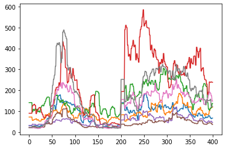
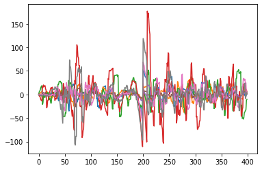
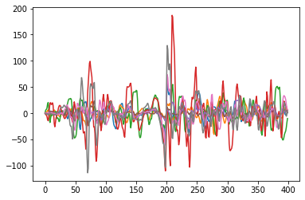
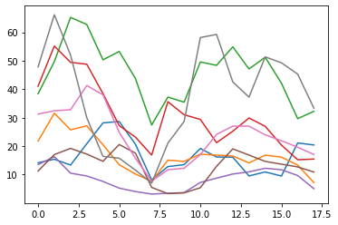
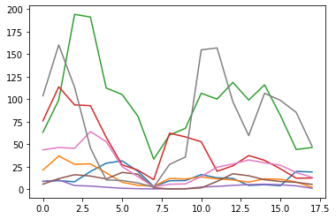
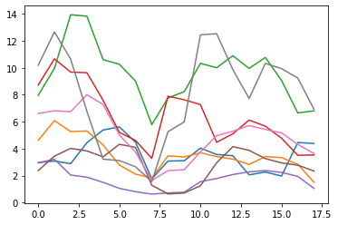

## Importando Bibliotecas


```python
import numpy as np
import os

from sklearn import svm
from sklearn.svm import SVC
from sklearn.model_selection import train_test_split
from sklearn.multiclass import OutputCodeClassifier
from sklearn.svm import LinearSVC
from sklearn.preprocessing import StandardScaler
from sklearn import svm
from sklearn.discriminant_analysis import LinearDiscriminantAnalysis
from scipy.signal import welch
from sklearn.metrics import (brier_score_loss, precision_score, recall_score,f1_score)
from scipy import signal
import matplotlib.pyplot as plt
```

## Filtros


```python
def butter_bandpass(data, lowcut, highcut, fs=200, order=4):
    nyq = fs * 0.5
    low = lowcut / nyq
    high = highcut / nyq
    b, a = signal.butter(order, [low, high], btype='bandpass')
    return signal.filtfilt(b, a, data)


def butter_lowpass(data, lowcut, fs=200, order=4):
    nyq = fs * 0.5
    low = lowcut / nyq
    b, a = signal.butter(order, low, btype='lowpass')
    return signal.filtfilt(b, a, data)


def butter_highpass(data, highcut, fs=200, order=4):
    nyq = fs * 0.5
    high = highcut / nyq
    b, a = signal.butter(order, high, btype='highpass')
    return signal.filtfilt(b, a, data)


def butter_notch(data, cutoff, var=1, fs=200, order=4):
    nyq = fs * 0.5
    low = (cutoff - var) / nyq
    high = (cutoff + var) / nyq
    b, a = signal.iirfilter(order, [low, high], btype='bandstop', ftype="butter")
    return signal.filtfilt(b, a, data)
```

## Classificador


```python
def vaiSVC(X,y):
    X_train, X_test, y_train, y_test = train_test_split(X, y, test_size = 0.2, shuffle=True)


    for kernel in ['rbf']:#, 'linear']:
        for gamma in [0.001, 0.01, 0.1]:
            for C in [1, 10, 100, 1000]:
                classificador = []
                classificador = svm.SVC(gamma=gamma, C=C, kernel=kernel).fit(X_train, y_train)
                print('acuracia:', (classificador.score(X_test, y_test)) * 100, 'kernel:', kernel, 'gamma:', gamma, 'C:', C)
            

```


```python
def vaiSVCselect(X,y, scr):
    X_train, X_test, y_train, y_test = train_test_split(X, y, test_size = 0.2, shuffle=True)

    maior = 0

    while maior == 0:
        for kernel in ['rbf']:#, 'linear']:
            for gamma in [0.001, 0.01, 0.1]:
                for C in [1, 10, 100, 1000]:
                    classificador = []
                    classificador = svm.SVC(gamma=gamma, C=C, kernel=kernel).fit(X_train, y_train)
                    
                    if((classificador.score(X_test, y_test)) * 100 > scr):
                        maior = classificador
                        print('acuracia:', (classificador.score(X_test, y_test)) * 100, 'kernel:', kernel, 'gamma:', gamma, 'C:', C)
            
```

## Filtragem de Plotagem


```python
def filtering (dataset):
    
    
    for i in range(dataset.shape[1]):
        plt.plot(dataset[0,i,:])
    plt.show()
    data_filtered = []
    #print(dataset.shape[i])
    print(dataset.shape)
    
    data_filtered = butter_notch(dataset, 60)
    for i in range(data_filtered.shape[1]):
        plt.plot(data_filtered[0,i,:])
    plt.show()
    
    data_filtered = butter_highpass(data_filtered, 5)
    for i in range(data_filtered.shape[1]):
        plt.plot(data_filtered[0,i,:])
    plt.show()
    
    data_filtered = butter_lowpass(data_filtered, 50)
    for i in range(data_filtered.shape[1]):
        plt.plot(data_filtered[0,i,:])
    plt.show()
    
    return data_filtered


```

## Carregando Dados


```python
path1 = [os.path.join("coletas1", nome) for nome in os.listdir("coletas1")]
```

## Gestos


```python
print(path1)
```

    ['coletas1/indicador', 'coletas1/anelar', 'coletas1/mindinho', 'coletas1/dedo medio', 'coletas1/mao', 'coletas1/polegar']


## Estruturando e Carregando os arquivos


```python
path1 = [os.path.join("coletas1", nome) for nome in os.listdir("coletas1")]
data = np.array([])
pathsofTrials = []

for path in path1:
    path = [os.path.join(path, str(nome)) for nome in os.listdir(path)]
    for path2 in path:
        print('\n')
        print(path2)
        path3 = [os.path.join(path2, str(nome)) for nome in os.listdir(path2)]
        tentativa = []
        for path4 in path3:
            if('.npy' not in path4 ):
                print(path4)
                # lendo o arquivo
                arquivo = open(path4, 'r')
                coleta = []
                for linha in arquivo:
                    linha = linha.split(';')
                    array = []
                    for arr in linha:
                        arr = arr.strip('()')
                        arr = arr.split(',')
                        arrlist = []
                        for ar in arr:
                            if(ar != ''):
                                arrlist.append(int(ar))
                        #print(len(arrlist))
                        if(len(arrlist) > 0):
                            array.append(arrlist)
                        
                    #print(len(array))
                    
                    coleta.append(array)
                tentativa.append(coleta)
                #print(tentativa)
                arquivo.close()
        pathsofTrials.append(tentativa)
        
```

    
    
    coletas1/indicador/fecha
    coletas1/indicador/fecha/indicador fecha.txt
    coletas1/indicador/fecha/indicador fecha1.txt
    
    
    coletas1/indicador/abre
    coletas1/indicador/abre/indicador abre1.txt
    coletas1/indicador/abre/indicador abre.txt
    
    
    coletas1/anelar/fecha
    coletas1/anelar/fecha/anelar fecha.txt
    coletas1/anelar/fecha/anelar fecha1.txt
    
    
    coletas1/anelar/abre
    coletas1/anelar/abre/anelar abre.txt
    coletas1/anelar/abre/anelar abre1.txt
    
    
    coletas1/mindinho/fecha
    coletas1/mindinho/fecha/mindinho fecha.txt
    coletas1/mindinho/fecha/mindinho fecha1.txt
    
    
    coletas1/mindinho/abre
    coletas1/mindinho/abre/mindinho abre1.txt
    coletas1/mindinho/abre/mindinho abre.txt
    
    
    coletas1/dedo medio/fecha
    coletas1/dedo medio/fecha/medio fecha.txt
    coletas1/dedo medio/fecha/medio fecha1.txt
    
    
    coletas1/dedo medio/abre
    coletas1/dedo medio/abre/medio abre1.txt
    coletas1/dedo medio/abre/medio abre.txt
    
    
    coletas1/mao/fecha
    coletas1/mao/fecha/mao fecha.txt
    coletas1/mao/fecha/mao fecha1.txt
    
    
    coletas1/mao/abre
    coletas1/mao/abre/mao abre1.txt
    coletas1/mao/abre/mao abre.txt
    
    
    coletas1/polegar/fecha
    coletas1/polegar/fecha/polegar fecha1.txt
    coletas1/polegar/fecha/polegar fecha.txt
    
    
    coletas1/polegar/abre
    coletas1/polegar/abre/polegar abre.txt
    coletas1/polegar/abre/polegar abre1.txt


### GESTO X ELETRODOS X DADOS


```python
dataset = np.array(pathsofTrials)
print(dataset.shape)
dataset = dataset.swapaxes(1,2)
print(dataset.shape)
dataset = dataset.reshape(12,2,200,8)
print(dataset.shape)
dataset = dataset.reshape(12,400,8)
print(dataset.shape)
dataset = dataset.swapaxes(1,2)
print(dataset.shape)
```

    (12, 2, 1, 200, 8)
    (12, 1, 2, 200, 8)
    (12, 2, 200, 8)
    (12, 400, 8)
    (12, 8, 400)


### Filtragem: Notch, Highpass e Lowpass


```python
data_filtered = filtering(dataset)
```





    (12, 8, 400)








### Segmentação


```python
salto = 20
segmento = 50
print(data_filtered.shape)
n_win = int((data_filtered.shape[-1] - segmento) / salto) + 1
ids = np.arange(n_win) * salto
x = np.array([data_filtered[:,:,k:(k + segmento)] for k in ids]).transpose(1, 2, 0, 3)
print(x.shape)
```

    (12, 8, 400)
    (12, 8, 18, 50)


## Extração de Características

Para realização da classificação dos movimentos foi necessário extrair características tanto no domínio do tempo quanto no domínio da frequência.

### Domínio do Tempo

#### IEMG


```python
iemg =  np.sum(np.abs(x), axis=-1) / 50
print(iemg.shape)

for i in range(iemg.shape[1]):
    plt.plot(iemg[3,i,:])
plt.show()
```

    (12, 8, 18)





#### VAR


```python
var = np.sum(x ** 2, axis=-1) / (np.prod(x.shape[:-1]) - 1)
print(var.shape)

for i in range(var.shape[1]):
    plt.plot(var[3,i,:])
plt.show()
```

    (12, 8, 18)





#### RMS


```python
rms = np.sqrt(np.sum(np.abs(x) ** 2, axis=-1) / (np.prod(x.shape[:-1]) - 1))
print(rms.shape)

for i in range(rms.shape[1]):
    plt.plot(rms[3,i,:])
plt.show()
```

    (12, 8, 18)





### Corrigindo o shape

Foram concatenadas as características no domínio do tempo com os eletrodos e os segmentos, resultando no shape: (características , gestos)


```python
lista = [rms] + [var] + [iemg]
lista = np.array(lista)
lista = lista.swapaxes(0,1)
print(lista.shape)

lista = lista.reshape(12,3* 8* 18)
lista = lista.swapaxes(0,1)
print(lista.shape)


lista = lista[:,:][:432]
print(lista.shape)
```

    (12, 3, 8, 18)
    (432, 12)
    (432, 12)


#### Criando vetor de labels


```python
y = np.array([[str(i)] * int(lista.shape[0] / 12) for i in range(12)])
y = y.reshape(y.shape[0] * y.shape[1])
y.shape

```


    (432,)


```python
vaiSVC(lista,y)
```

    acuracia: 64.73988439306359 kernel: rbf gamma: 0.001 C: 1
    acuracia: 75.72254335260115 kernel: rbf gamma: 0.001 C: 10
    acuracia: 77.45664739884393 kernel: rbf gamma: 0.001 C: 100
    acuracia: 75.72254335260115 kernel: rbf gamma: 0.001 C: 1000
    acuracia: 47.97687861271676 kernel: rbf gamma: 0.01 C: 1
    acuracia: 52.02312138728323 kernel: rbf gamma: 0.01 C: 10
    acuracia: 52.02312138728323 kernel: rbf gamma: 0.01 C: 100
    acuracia: 52.02312138728323 kernel: rbf gamma: 0.01 C: 1000
    acuracia: 29.47976878612717 kernel: rbf gamma: 0.1 C: 1
    acuracia: 30.057803468208093 kernel: rbf gamma: 0.1 C: 10
    acuracia: 30.057803468208093 kernel: rbf gamma: 0.1 C: 100
    acuracia: 30.057803468208093 kernel: rbf gamma: 0.1 C: 1000


## Domínio da Frequência


```python
from scipy.signal import stft

print(data_filtered.shape)
_, _, w = stft(data_filtered, fs=200, nperseg=200, noverlap=32)
w = w.swapaxes(2,3)
print(w.shape)
```

    (12, 8, 400)
    (12, 8, 4, 101)


#### PSD


```python
def PSD(x):
    return np.sqrt(np.abs(x))
```

#### FMD


```python
fmd = np.sum(PSD(w), axis=-1) / 2
print(fmd.shape)


```

    (12, 8, 4)


#### MMDF


```python
mmdf = np.sum(np.abs(w), axis=-1) / 2
print(mmdf.shape)
```

    (12, 8, 4)


#### Corrigindo Shape


```python
frelist = [fmd] + [mmdf]
frelist = np.array(frelist)
frelist = frelist.swapaxes(0,1)
print(frelist.shape)
frelist = frelist.reshape(12,2*8*4)
frelist = frelist.swapaxes(0,1)
frelist = frelist[:][:60]
print(frelist.shape)
```

    (12, 2, 8, 4)
    (60, 12)


#### Criando vetor de labels


```python
y2 = np.array([[str(i)] * int(frelist.shape[0] / 12) for i in range(12)])
print(y2.shape)
y2 = y2.reshape(y2.shape[0] * y2.shape[1])
y2.shape

```

    (12, 5)


    (60,)


### Classificando


```python
vaiSVC(frelist,y2)
```

    acuracia: 8.333333333333332 kernel: rbf gamma: 0.001 C: 1
    acuracia: 25.0 kernel: rbf gamma: 0.001 C: 10
    acuracia: 25.0 kernel: rbf gamma: 0.001 C: 100
    acuracia: 25.0 kernel: rbf gamma: 0.001 C: 1000
    acuracia: 8.333333333333332 kernel: rbf gamma: 0.01 C: 1
    acuracia: 8.333333333333332 kernel: rbf gamma: 0.01 C: 10
    acuracia: 8.333333333333332 kernel: rbf gamma: 0.01 C: 100
    acuracia: 8.333333333333332 kernel: rbf gamma: 0.01 C: 1000
    acuracia: 8.333333333333332 kernel: rbf gamma: 0.1 C: 1
    acuracia: 8.333333333333332 kernel: rbf gamma: 0.1 C: 10
    acuracia: 8.333333333333332 kernel: rbf gamma: 0.1 C: 100
    acuracia: 8.333333333333332 kernel: rbf gamma: 0.1 C: 1000


## Combinação domínio do tempo e frequência


```python
print(lista.shape)
print(frelist.shape)

X = np.concatenate((lista, frelist), axis=0)
yf = np.concatenate((y2 , y), axis=0)
print(y2.shape, y.shape)
print(yf.shape)
print(X.shape)
```

    (432, 12)
    (60, 12)
    (60,) (432,)
    (492,)
    (492, 12)


```python
vaiSVC(X,yf)
```

    acuracia: 49.494949494949495 kernel: rbf gamma: 0.001 C: 1
    acuracia: 66.66666666666666 kernel: rbf gamma: 0.001 C: 10
    acuracia: 72.72727272727273 kernel: rbf gamma: 0.001 C: 100
    acuracia: 70.70707070707071 kernel: rbf gamma: 0.001 C: 1000
    acuracia: 40.4040404040404 kernel: rbf gamma: 0.01 C: 1
    acuracia: 49.494949494949495 kernel: rbf gamma: 0.01 C: 10
    acuracia: 50.505050505050505 kernel: rbf gamma: 0.01 C: 100
    acuracia: 50.505050505050505 kernel: rbf gamma: 0.01 C: 1000
    acuracia: 25.252525252525253 kernel: rbf gamma: 0.1 C: 1
    acuracia: 27.27272727272727 kernel: rbf gamma: 0.1 C: 10
    acuracia: 27.27272727272727 kernel: rbf gamma: 0.1 C: 100
    acuracia: 27.27272727272727 kernel: rbf gamma: 0.1 C: 1000


```python
vaiSVCselect(X,yf, 60)
```

    acuracia: 71.71717171717171 kernel: rbf gamma: 0.001 C: 10
    acuracia: 76.76767676767676 kernel: rbf gamma: 0.001 C: 100
    acuracia: 72.72727272727273 kernel: rbf gamma: 0.001 C: 1000


```python

```
